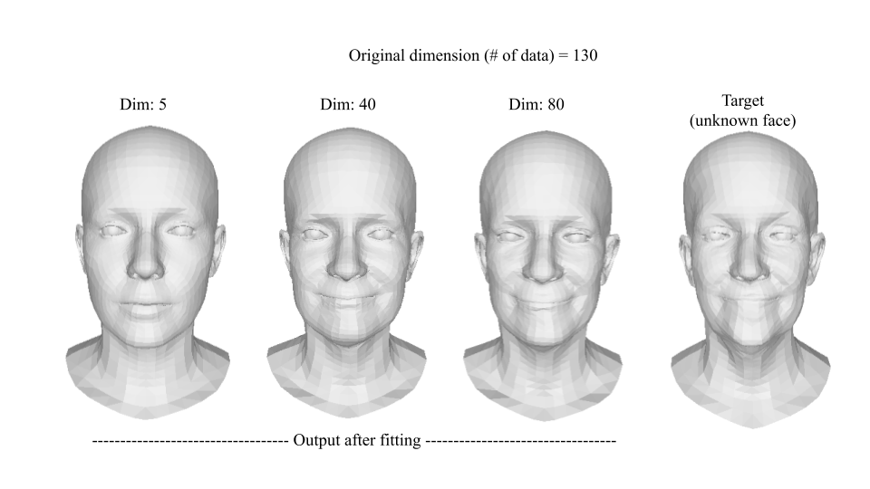

# Simple Eigen 3D Face Fitting
Quite simple python3 implementation for eigen 3D face fitting

- Run PCA_FACE.ipynb to apply fitting to the target 3D face using the eigen 3D faces. The program saves the result and mean face.
- The dimensionality reduction is done using PCA.
- "Dim" in the image represents the number of eigen vectors used for the fitting.
- The dataset is taken from [here](http://flame.is.tue.mpg.de/)
"T. Li, T. Bolkart, M. J. Black, H. Li, and J. Romero. Learning
a model of facial shape and expression from 4D scans. ACM
Transactions on Graphics (SIGGRAPH Asia), 36(6), 2017"
